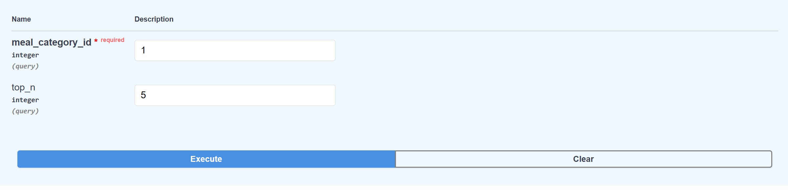
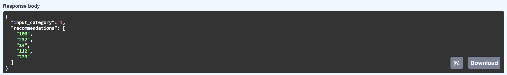
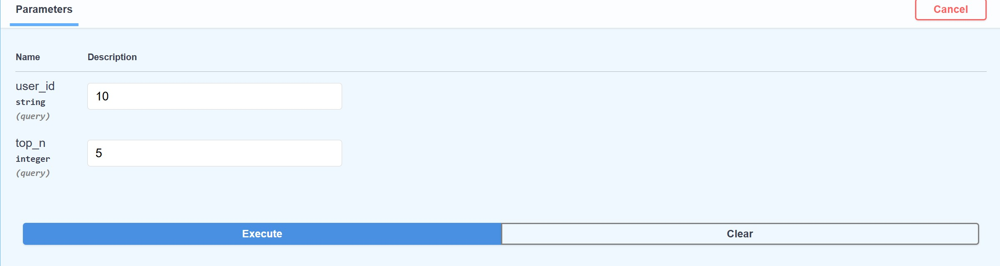
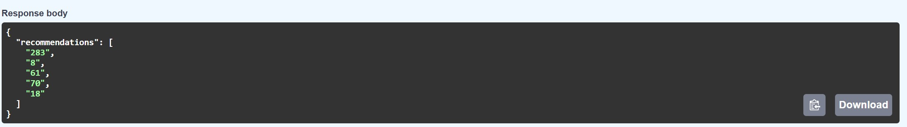

# RecommendationSytem

**Bachelor’s Thesis titled "Personalized Meal Recommendation System"**
showcasing the implementation and evaluation of different recommendation techniques (Collaborative Filtering, Content-Based, and Hybrid). Includes API deployment using FastAPI and performance benchmarking using Precision, Recall, and F1 Score.

**Includes** full FastAPI deployment code (as used in PyCharm)  
**Excludes** dataset due to privacy concerns

---
## Project Overview

This recommendation system integrates:
- **Collaborative Filtering (SVD)** – Learns user preferences from historical meal interaction data.
- **Content-Based Filtering (TF-IDF + Nearest Neighbors)** – Suggests meals with similar categories or characteristics.
- **Hybrid Recommendation** – Combines both methods (non-weighted and weighted versions).

A real-time API was deployed using **FastAPI** and tested via **Swagger UI** in PyCharm.

User behaviour data (e.g., meal views and purchases) was tracked via **Google Analytics 4 (GA4)** and joined with metadata (e.g., meal categories) using **Google BigQuery**.

---

## Technologies Used

| Tool / Platform            | Purpose                                                                 |
|----------------------------|-------------------------------------------------------------------------|
| **Python**                 | Core language for model development                                    |
| **Pandas, NumPy**          | Data preprocessing and manipulation                                    |
| **Scikit-learn**           | ML models – SVD (CF), TF-IDF, Nearest Neighbors (CBF)                  |
| **FastAPI**                | API framework for serving recommendations                             |
| **Jupyter Notebook**       | Model evaluation and metric analysis                                   |
| **GA4 (Google Analytics 4)** | User event tracking (views, purchases)                              |
| **BigQuery**               | SQL-based data linking (user behaviour ↔ meal metadata)                |

---

## Model Evaluation

- Code: `model_evaluation.py`

Evaluated on test data using:
- **Precision@5**
- **Recall@5**
- **F1 Score@5**

Benchmarked Models:
- Collaborative Filtering (SVD)
- Content-Based Filtering (TF-IDF)
- Hybrid (non-weighted)
- Hybrid (weighted)

  
   
  <em>Evaluation summary of all 4 models</em>

---

## Swagger UI API Demonstration

### 🔹 Recommend by Category ID

  
   
  <em>Input: Meal Category ID in Swagger UI</em>

  
   
  <em>Output: Top meals recommended based on category popularity</em>

---

### 🔹 Recommend by User ID (Hybrid)

  
   
  <em>Input: User ID in Swagger UI</em>

  
   
  <em>Output: Hybrid recommendations based on user behavior</em>

---

## Swagger UI Input/Output Screenshots

| Image File                        | Description                                                                 |
|----------------------------------|-----------------------------------------------------------------------------|
| `Meals_Reco_by_CategoryId.jpg`         | Input screen: API request using `meal_category_id` with a limit of 5 recommendations |
| `Meals_Reco_by_CategoryId_Results.jpg` | Output screen: Recommended meals based on the selected `meal_category_id` |
| `Meals_Reco_by_id.jpg`                | Input screen: API request using `user_id` with a limit of 5 recommendations |
| `Meals_Reco_by_id_Results.jpg`        | Output screen: Recommended meals based on user behavior and interaction history |

---
